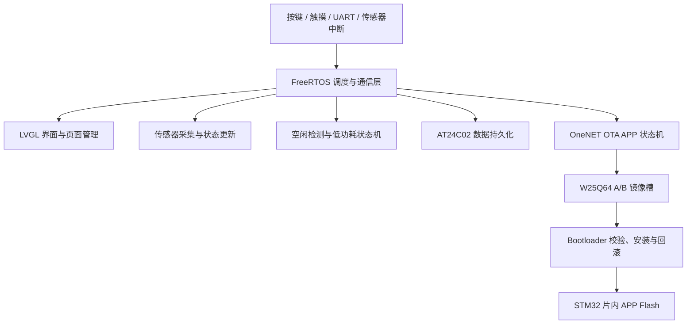
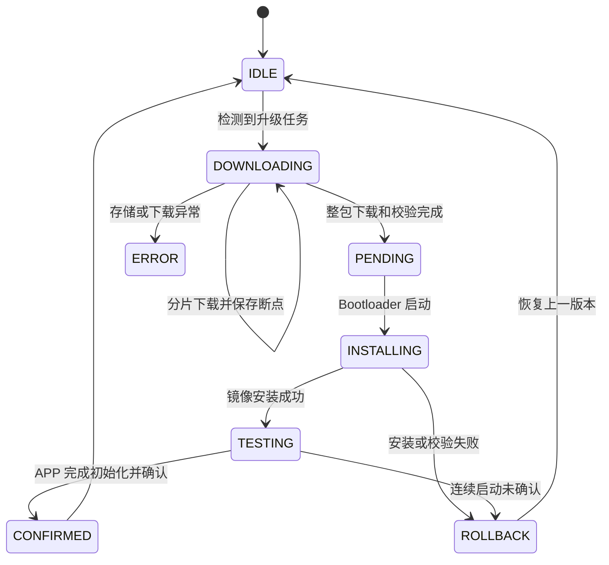

# STM32F411 LVGL 智能手表

一个基于 **STM32F411CEU6、FreeRTOS 和 LVGL** 实现的智能手表固件项目。项目以可维护性和运行可靠性为核心，将界面刷新、按键处理、传感器采集、串口通信、数据持久化、低功耗控制和 OTA 升级拆分为独立模块，并通过消息队列完成异步协作。

项目重点实现了以下四部分：

- **FreeRTOS 多任务架构**：按照职责拆分任务，使用消息队列、消息缓冲区、任务通知和软件定时器完成模块间通信。
- **OneNET OTA A/B 升级**：支持 AES-128-CTR 加密、CRC32 完整性校验、分片下载、断点续传、掉电保护、试运行确认与失败自动回滚。
- **EEPROM 数据持久化**：使用 A/B 双槽、CRC16、递增序列号和提交标记保存关键配置与步数，避免掉电造成数据损坏。
- **整机低功耗管理**：根据无操作时长依次执行背光降亮、外设休眠和 STM32 STOP 模式，并支持按键、充电事件和 MPU6050 抬腕唤醒。

## 1. 系统组成

### 1.1 硬件与软件

| 类别 | 方案 | 作用 |
| --- | --- | --- |
| 主控 | STM32F411CEU6 / Cortex-M4 | 运行 FreeRTOS、LVGL 和业务逻辑 |
| 实时系统 | FreeRTOS / CMSIS-RTOS2 | 任务调度、队列、定时器与任务通知 |
| 图形界面 | LVGL | 表盘、菜单、设置页和状态显示 |
| LCD | ST7789 | 界面显示，支持 Sleep In / Sleep Out |
| 触摸 | CST816 | 触摸输入与低功耗控制 |
| 运动传感器 | MPU6050 | 步数、姿态和抬腕检测 |
| 参数存储 | AT24C02 EEPROM | 用户设置、步数和 OTA 元数据 |
| 固件存储 | W25Q64 SPI NOR Flash | 保存 A/B 两个 OTA 固件镜像 |
| 固件安全 | AES-128-CTR + CRC32 | 固件加密、传输校验与安装校验 |
| 开发工具 | STM32CubeMX、Keil MDK-ARM、Python | 工程配置、固件构建和 OTA 包生成 |

### 1.2 总体架构



系统分为三层：

1. **驱动与中断层**负责采集按键、UART、传感器和充电状态，将中断中的数据快速转交给 RTOS 通信对象。
2. **任务与业务层**负责界面刷新、传感器处理、数据保存、运行模式切换和 OTA 下载，避免在中断中执行耗时逻辑。
3. **Bootloader 与存储层**负责固件镜像管理、升级安装、试运行确认以及异常回滚。

## 2. FreeRTOS 多任务架构

### 2.1 任务划分

任务统一在 [`user_TasksInit.c`](OV_Watch/User/Tasks/Src/user_TasksInit.c) 中创建，并按照实时性和业务重要程度分配优先级。硬件初始化和 STOP 状态切换使用较高优先级；界面、传感器、数据保存和 OTA 等后台工作使用普通或较低优先级。

| 任务 | 优先级 | 主要职责 |
| --- | --- | --- |
| `HardwareInitTask` | High3 | 初始化板级外设和功能模块，恢复 EEPROM 数据，完成 OTA 新固件试运行确认 |
| `StopEnterTask` | High1 | 响应深度休眠请求，管理外设下电、STOP 模式进入与唤醒恢复 |
| `IdleEnterTask` | High | 响应空闲状态消息，降低或恢复屏幕亮度 |
| `KeyTask` | Normal | 扫描并处理按键事件，将输入转换为界面或系统控制动作 |
| `LvHandlerTask` | Low | 周期调用 LVGL 任务处理函数，维持 UI 动画与控件刷新 |
| `ScrRenewTask` | Low1 | 根据输入消息执行页面切换和界面状态更新 |
| `SensorDataTask` | Low1 | 周期获取传感器数据并更新温度、湿度、气压、步数等界面数据 |
| `ChargPageEnterTask` | Low1 | 处理充电状态变化及充电页面显示 |
| `MessageSendTask` | Low1 | 处理 UART 接收帧、设备通信和相关异步消息 |
| `MPUCheckTask` | Low2 | 处理 MPU6050 状态、姿态变化和抬腕相关逻辑 |
| `DataSaveTask` | Low2 | 异步保存设置、日期和步数，执行跨日步数清零 |
| `OtaTask` | Low2 | 定期检查 OneNET 升级任务，下载并校验固件包 |

这种拆分避免了以下问题：

- LVGL 刷新被 EEPROM 写入或网络下载长时间阻塞。
- 按键、UART 等实时输入与传感器轮询互相干扰。
- 低功耗切换散落在多个业务模块中，导致外设状态难以统一恢复。
- 配置保存直接发生在 UI 回调中，增加界面卡顿和 EEPROM 频繁写入风险。

### 2.2 任务间通信

项目没有让各任务直接互相调用复杂业务流程，而是使用 RTOS 通信对象传递事件：

| 通信对象 | 生产者 | 消费者 | 用途 |
| --- | --- | --- | --- |
| `Key_MessageQueue` | 按键任务 | 页面刷新任务 | 传递按键操作 |
| `Idle_MessageQueue` | 空闲软件定时器 | 空闲任务 | 请求降低背光亮度 |
| `Stop_MessageQueue` | 空闲软件定时器/传感器逻辑 | STOP 任务 | 请求进入深度休眠 |
| `IdleBreak_MessageQueue` | 按键、串口或传感器事件 | 空闲任务 | 重置无操作计时并恢复亮度 |
| `HomeUpdata_MessageQueue` | 系统唤醒、传感器任务 | 首页数据更新逻辑 | 请求重新同步首页显示 |
| `DataSave_MessageQueue` | 设置页、传感器任务 | 数据保存任务 | 请求保存设置或步数 |
| `UartRxMessageBuffer` | UART IDLE 中断 | 通信任务 | 按完整帧传递串口数据 |

UART 使用 `HAL_UARTEx_ReceiveToIdle_DMA()` 接收不定长数据。IDLE 中断到来后，ISR 将完整帧写入静态 Message Buffer，再立即重新启动 DMA 接收。这样既保留帧边界，也避免通信解析逻辑占用中断时间。

### 2.3 空闲检测与调度设计

- 100 ms 周期软件定时器累加无操作时长。
- 达到息屏时间后向 `Idle_MessageQueue` 投递事件，先降低背光亮度。
- 达到关机/休眠时间后向 `Stop_MessageQueue` 投递事件，由专用任务执行 STOP 流程。
- 按键、通信或有效传感器事件会发送空闲中断消息，清零计时并恢复屏幕。
- FreeRTOS 启用 Tickless Idle，在没有可运行任务时减少无效 Tick 中断。

相关源码：

- [`user_TasksInit.c`](OV_Watch/User/Tasks/Src/user_TasksInit.c)
- [`user_RunModeTasks.c`](OV_Watch/User/Tasks/Src/user_RunModeTasks.c)
- [`user_MessageSendTask.c`](OV_Watch/User/Tasks/Src/user_MessageSendTask.c)
- [`stm32f4xx_it.c`](OV_Watch/Core/Src/stm32f4xx_it.c)

## 3. OneNET OTA A/B 升级

### 3.1 设计目标

OTA 模块需要解决的不只是“下载并覆盖固件”，还需要处理下载中断、镜像损坏、安装掉电和新固件无法正常启动等异常情况。因此系统将下载、安装与启动确认拆分为 APP 和 Bootloader 两个阶段：

- **APP**：检查 OneNET 任务、下载升级包、保存断点、校验密文并请求重启。
- **Bootloader**：校验镜像、解密固件、写入片内 Flash、管理试运行状态和失败回滚。

### 3.2 存储布局

STM32F411 不能直接从普通 SPI NOR Flash 执行程序，因此 W25Q64 的 A/B 分区用于保存镜像，真正运行的 APP 仍安装在 MCU 片内 Flash。

| 存储器 | 地址范围 | 大小 | 用途 |
| --- | --- | ---: | --- |
| STM32 片内 Flash | `0x08000000 ~ 0x0800FFFF` | 64 KiB | Bootloader |
| STM32 片内 Flash | `0x08010000 ~ 0x0807FFFF` | 448 KiB | 当前运行的 APP |
| W25Q64 | `0x000000 ~ 0x0FFFFF` | 1 MiB | A 镜像槽 |
| W25Q64 | `0x100000 ~ 0x1FFFFF` | 1 MiB | B 镜像槽 |
| W25Q64 | `0x200000 ~ 0x7FFFFF` | 6 MiB | 预留业务数据区 |
| AT24C02 | `0x40 ~ 0x9F` | 96 B | OTA 元数据副本 0 |
| AT24C02 | `0xA0 ~ 0xFF` | 96 B | OTA 元数据副本 1 |

### 3.3 OTA 状态机



各状态的职责如下：

- `IDLE`：当前无升级任务，APP 按周期向 OneNET 检查新版本。
- `DOWNLOADING`：升级包写入非活动槽，并持续更新已下载偏移。
- `PENDING`：完整升级包已经通过 APP 侧校验，等待 Bootloader 安装。
- `INSTALLING`：Bootloader 正在备份旧固件、解密新镜像并写入片内 Flash。
- `TESTING`：新固件进入试运行阶段，必须在初始化成功后主动确认。
- `CONFIRMED`：新版本确认可用，Bootloader 将状态恢复为 `IDLE`。
- `ROLLBACK`：新固件无效或试运行失败，重新安装上一版本镜像。
- `ERROR`：记录具体错误码，由 APP 上报后清理状态。

### 3.4 分片下载与断点续传

OTA 任务启动后延时等待系统硬件初始化，然后每 60 秒检查一次升级任务：

1. 获取任务 ID、目标版本、升级包大小和下载令牌。
2. 根据当前活动槽选择另一个槽作为下载目标，防止覆盖可回滚镜像。
3. 先读取并校验 256 字节固件包头，确认加载地址、镜像大小、加密标志和 Key ID 合法。
4. 每次请求最多 1024 字节，使用 Range 偏移连续下载到 W25Q64。
5. 每累计写入 4 KiB，将 `downloaded_size` 保存到 AT24C02 元数据。
6. 设备复位后重新加载元数据，从最近一次已提交偏移继续下载。
7. 下载完成后重新计算密文 CRC32，通过后才将状态切换为 `PENDING`。

下载失败不会立即擦除已保存数据。短时错误会重试，超过单轮重试次数后保留 `DOWNLOADING` 状态，下一轮检查可继续断点下载。

### 3.5 固件包格式与校验链

升级包由 **256 字节头部 + AES-128-CTR 密文负载**组成。头部包含：

- 固件格式版本与目标固件版本。
- APP 加载地址、明文大小和密文大小。
- 明文 CRC32 与密文 CRC32。
- AES CTR 初始向量 IV、Key ID 和头部 CRC32。

安装前后按以下顺序校验：

1. 校验包头魔数、格式版本、大小范围、加载地址和头部 CRC32。
2. 校验 W25Q64 中密文负载 CRC32，确认下载内容完整。
3. 解密前 8 字节并校验初始栈指针与 Reset Handler，防止写入非法镜像。
4. AES-128-CTR 流式解密，同时按 256 字节块写入 STM32 片内 Flash。
5. 校验解密过程得到的明文 CRC32。
6. 再次读取片内 Flash 计算 CRC32，确认实际写入内容与镜像一致。
7. 重新检查片内向量表后才允许跳转 APP。

### 3.6 掉电保护与自动回滚

- 第一次升级前，Bootloader 会将当前片内 APP 备份到 W25Q64 的旧版本槽。
- 擦除片内 APP 前，先持久化 `previous_slot` 和回滚有效标记。
- OTA 元数据使用双副本交替保存；每个副本包含序列号和 CRC32，启动时选择最新有效记录。
- 安装过程中复位时，Bootloader 根据 `INSTALLING` 状态和片内 APP 有效性决定继续保护或执行回滚。
- 新 APP 启动后进入 `TESTING`。完成硬件和 LVGL 初始化后调用 `ota_app_confirm_running_image()` 确认运行成功。
- 连续 3 次启动仍未确认、镜像安装失败或向量表无效时，自动恢复上一版本。

### 3.7 OneNET 适配接口

OTA 状态机与通信模组解耦，网络层只需实现以下三个接口：

```c
int onenet_ota_port_check(uint32_t current_version,
                          onenet_ota_job_t *job);

int onenet_ota_port_download_range(const onenet_ota_job_t *job,
                                   uint32_t offset,
                                   uint8_t *buffer,
                                   uint32_t capacity,
                                   uint32_t *received);

void onenet_ota_port_report(const onenet_ota_job_t *job,
                            ota_state_t state,
                            uint8_t progress,
                            ota_error_t error);
```

这样可以根据实际使用的 4G、Wi-Fi 或 NB-IoT 模组实现 AT 指令和鉴权逻辑，而不用修改 OTA 下载、校验和回滚状态机。

相关源码：

- [`ota_app.c`](OV_Watch/User/OTA/ota_app.c)
- [`ota_onenet_port.c`](OV_Watch/User/OTA/ota_onenet_port.c)
- [`ota_boot.c`](bootloader/User/ota_boot.c)
- [`ota_storage.c`](OTA_Common/ota_storage.c)
- [`ota_aes.c`](OTA_Common/ota_aes.c)
- [`ota_crc32.c`](OTA_Common/ota_crc32.c)
- [`OTA_README.md`](OTA_README.md)

## 4. EEPROM 数据持久化

### 4.1 保存内容

用户数据保存在 AT24C02 的前 64 字节，主要包括：

- 抬腕唤醒开关。
- APP 自动校时开关。
- 数据所属的年、月、日。
- 当日步数。

剩余 EEPROM 空间用于 OTA 元数据，实现用户配置与 OTA 状态共用一颗 EEPROM，同时通过固定地址范围隔离。

| 地址范围 | 用途 |
| --- | --- |
| `0x00 ~ 0x1F` | 用户数据槽 A |
| `0x20 ~ 0x3F` | 用户数据槽 B |
| `0x40 ~ 0x9F` | OTA 元数据副本 0 |
| `0xA0 ~ 0xFF` | OTA 元数据副本 1 |

### 4.2 记录格式

每个用户数据槽为 32 字节，其中有效记录使用 24 字节：

| 字段 | 作用 |
| --- | --- |
| Magic `USR1` | 识别有效的数据类型 |
| 格式版本与记录长度 | 支持结构升级并拒绝不兼容数据 |
| 递增序列号 | 判断 A/B 槽中哪条记录更新 |
| 设置标志位 | 保存抬腕唤醒、APP 校时开关 |
| 日期与步数 | 恢复当日计步状态 |
| CRC16-CCITT | 检测记录内容损坏 |
| Commit Marker | 最后写入，标识整条记录已完整提交 |

### 4.3 A/B 原子提交

数据保存时始终写入当前活动槽的另一个槽：

1. 选择非活动槽，并将其提交标记置为无效。
2. 写入带新序列号和 CRC16 的记录主体。
3. 回读并比较主体数据，确认 EEPROM 写入正确。
4. 最后单独写入 Commit Marker。
5. 再次读取和完整解码，成功后才切换内存中的活动槽。

如果步骤 2～4 期间掉电，新槽不会同时满足 CRC 与提交标记校验；下次启动仍会使用旧槽，避免半条记录覆盖最后一份有效数据。

### 4.4 保存时机与磨损控制

`DataSaveTask` 不会每次步数变化都立即写 EEPROM，而是使用以下策略合并写入：

- 用户修改抬腕唤醒或 APP 校时设置时保存。
- 相比上次记录累计增加 100 步时保存。
- 步数发生变化且距离上次保存超过 5 分钟时保存。
- 收到强制保存事件时立即保存。
- 数据任务每秒检查一次状态，即使设置消息因队列已满丢失，也会在下一次轮询发现差异。

### 4.5 启动恢复与跨日处理

- 启动时分别校验 A/B 槽，选择序列号更新且校验通过的记录。
- 两个槽均无效时使用默认配置，并立即创建第一条有效记录。
- 当前 RTC 日期与记录日期相同，则恢复保存的步数和设置。
- 如果 MPU6050 在当天异常复位导致计数变小，优先保留 EEPROM 中较大的步数，避免当天数据倒退。
- 检测到自然跨日、APP 校时或手动修改日期时，将步数清零并保存新日期。
- 支持从早期稀疏存储格式迁移到新的 A/B 记录格式。

相关源码：

- [`DataSave.c`](OV_Watch/BSP/BL24C02/DataSave.c)
- [`DataSave.h`](OV_Watch/BSP/BL24C02/DataSave.h)
- [`user_DataSaveTask.c`](OV_Watch/User/Tasks/Src/user_DataSaveTask.c)

## 5. 整机低功耗管理

### 5.1 分级低功耗策略

系统不在超时后直接进入 STOP，而是分两个阶段处理：

1. **Idle 阶段**：达到用户设置的息屏时间后降低背光，系统任务仍正常运行，可快速恢复交互。
2. **STOP 阶段**：继续无操作并达到深度休眠时间后，关闭高功耗外设并进入 STM32 STOP 模式。

通过这种分级策略，短暂空闲无需频繁重建外设状态，长时间不操作时又能获得更低功耗。

### 5.2 进入 STOP 的处理顺序

`StopEnterTask` 阻塞等待休眠消息，收到请求后统一执行以下流程：

1. 清零空闲计数，清除 EXTI 和 NVIC 中遗留的挂起标志。
2. 通过 HAL 接口停止 UART/DMA，避免外设句柄状态与实际硬件状态不一致。
3. 关闭 LCD 背光，使 ST7789 进入 Sleep In。
4. 使 CST816 进入深度休眠。
5. 如果未开启抬腕唤醒，则让 MPU6050 进入休眠；开启抬腕时保留其循环低功耗检测。
6. 暂停 FreeRTOS 调度器，保证系统时钟与外设暂停期间没有任务继续运行。
7. 挂起 HAL Tick，关闭 SysTick 中断，清除定时器和唤醒标志。
8. 关闭 STOP 调试功能，启用 Flash Power-down 和低功耗稳压器。
9. 在关中断状态下再次检查唤醒事件，避免“事件刚到达但随后进入 WFI”的竞争窗口。
10. 调用 `HAL_PWR_EnterSTOPMode()` 进入 STOP。

### 5.3 唤醒源

系统支持以下事件打断低功耗状态：

- 物理按键中断。
- 充电状态变化。
- MPU6050 中断，并进一步判断是否满足有效抬腕姿态。

对于无效的 MPU6050 姿态变化，系统会再次进入 STOP，而不是完整唤醒界面，从而减少误唤醒功耗。

### 5.4 唤醒恢复

STM32 从 STOP 唤醒后系统时钟会回到 HSI，因此必须按顺序恢复运行环境：

1. 恢复 HAL Tick，并重新配置 PLL 与 100 MHz 系统时钟。
2. 恢复 SysTick 中断和 FreeRTOS 调度器。
3. 重新初始化 USART1，恢复 UART IDLE + DMA 接收。
4. 根据休眠前状态唤醒 MPU6050。
5. 使 ST7789 执行 Sleep Out，恢复背光和用户设置亮度。
6. 唤醒 CST816 触摸控制器。
7. 重新处理充电状态，并向首页投递刷新消息。

相关源码：

- [`user_RunModeTasks.c`](OV_Watch/User/Tasks/Src/user_RunModeTasks.c)
- [`freertos.c`](OV_Watch/Core/Src/freertos.c)
- [`lcd_init.c`](OV_Watch/BSP/LCD/lcd_init.c)
- [`CST816.c`](OV_Watch/BSP/TOUCH/CST816.c)
- [`mpu6050.c`](OV_Watch/BSP/MPU6050/mpu6050.c)

## 6. 工程目录

```text
.
├── OV_Watch/
│   ├── BSP/                         # LCD、触摸、MPU6050、EEPROM 等驱动
│   ├── Core/                        # STM32 HAL 初始化、中断、FreeRTOS 配置
│   ├── Middlewares/                 # FreeRTOS、LVGL 等中间件
│   ├── User/
│   │   ├── GUI_App/                 # LVGL 页面和 UI 逻辑
│   │   ├── OTA/                     # APP 侧 OTA 下载与 OneNET 接口
│   │   └── Tasks/                   # FreeRTOS 业务任务
│   ├── MDK-ARM/                     # Keil APP 工程
│   └── OV_Watch.ioc                 # STM32CubeMX 配置
├── bootloader/
│   ├── User/                        # Bootloader 安装、确认和回滚逻辑
│   └── MDK-ARM/                     # Keil Bootloader 工程
├── OTA_Common/                      # AES、CRC32、元数据、Flash/EEPROM 接口
├── tools/
│   └── ota_pack.py                  # 固件加密与 OTA 包生成工具
├── tests/                           # 可在主机运行的核心模块测试
└── OTA_README.md                    # OTA 接线、打包和 OneNET 适配说明
```

## 7. 构建与烧录

### 7.1 APP

使用 Keil MDK-ARM 打开：

```text
OV_Watch/MDK-ARM/OV_Watch.uvprojx
```

APP 链接地址为 `0x08010000`，为前 64 KiB Bootloader 区域预留空间。构建后生成用于烧录的 HEX 和用于 OTA 打包的 BIN 文件。

### 7.2 Bootloader

使用 Keil MDK-ARM 打开：

```text
bootloader/MDK-ARM/bootloader.uvprojx
```

首次部署时先烧录 Bootloader，再烧录从 `0x08010000` 链接的 APP。

### 7.3 生成 OTA 包

完成 APP 构建后执行：

```powershell
python tools/ota_pack.py `
  OV_Watch/MDK-ARM/output/OV_Watch.bin `
  OV_Watch/MDK-ARM/output/OV_Watch_v2.4.4.ota `
  --version 2.4.4 `
  --key-hex <32位十六进制AES密钥>
```

脚本会完成以下工作：

- 读取 APP BIN 并检查镜像大小。
- 生成随机 AES CTR IV。
- 使用 AES-128-CTR 加密固件内容。
- 计算明文、密文和包头 CRC32。
- 生成包含 256 字节头部的 `.ota` 文件。

OneNET 下发的文件应为 `.ota`，而不是未经打包的 `.bin`。

> 仓库中的默认密钥仅用于开发联调。实际产品应通过构建系统注入独立密钥，并避免将生产密钥提交到代码仓库。

## 8. 主机侧测试

`tests` 目录提供不依赖 STM32 硬件的核心逻辑测试：

| 测试 | 覆盖内容 |
| --- | --- |
| `test_ota_crypto.c` | CRC32 标准向量、AES-128-CTR 加密与解密 |
| `test_ota_storage.c` | OTA 元数据双副本、损坏回退、包头边界校验 |
| `test_user_data_storage.c` | 用户数据 A/B 保存、CRC 损坏回退、模拟掉电和旧格式迁移 |

这些测试重点验证难以只靠板上手工操作覆盖的异常路径，例如最新副本损坏、写入中途失败和元数据回退。

## 9. 关键实现索引

| 功能 | 主要文件 |
| --- | --- |
| 任务创建与 RTOS 通信对象 | [`user_TasksInit.c`](OV_Watch/User/Tasks/Src/user_TasksInit.c) |
| 空闲检测、STOP 与唤醒恢复 | [`user_RunModeTasks.c`](OV_Watch/User/Tasks/Src/user_RunModeTasks.c) |
| UART IDLE 帧接收与消息处理 | [`user_MessageSendTask.c`](OV_Watch/User/Tasks/Src/user_MessageSendTask.c) |
| 用户数据持久化任务 | [`user_DataSaveTask.c`](OV_Watch/User/Tasks/Src/user_DataSaveTask.c) |
| EEPROM A/B 记录 | [`DataSave.c`](OV_Watch/BSP/BL24C02/DataSave.c) |
| APP 侧 OTA 状态机 | [`ota_app.c`](OV_Watch/User/OTA/ota_app.c) |
| OneNET 网络适配层 | [`ota_onenet_port.c`](OV_Watch/User/OTA/ota_onenet_port.c) |
| Bootloader 安装与回滚 | [`ota_boot.c`](bootloader/User/ota_boot.c) |
| OTA 元数据双副本 | [`ota_storage.c`](OTA_Common/ota_storage.c) |
| AES-128-CTR 与 CRC32 | [`ota_aes.c`](OTA_Common/ota_aes.c)、[`ota_crc32.c`](OTA_Common/ota_crc32.c) |
