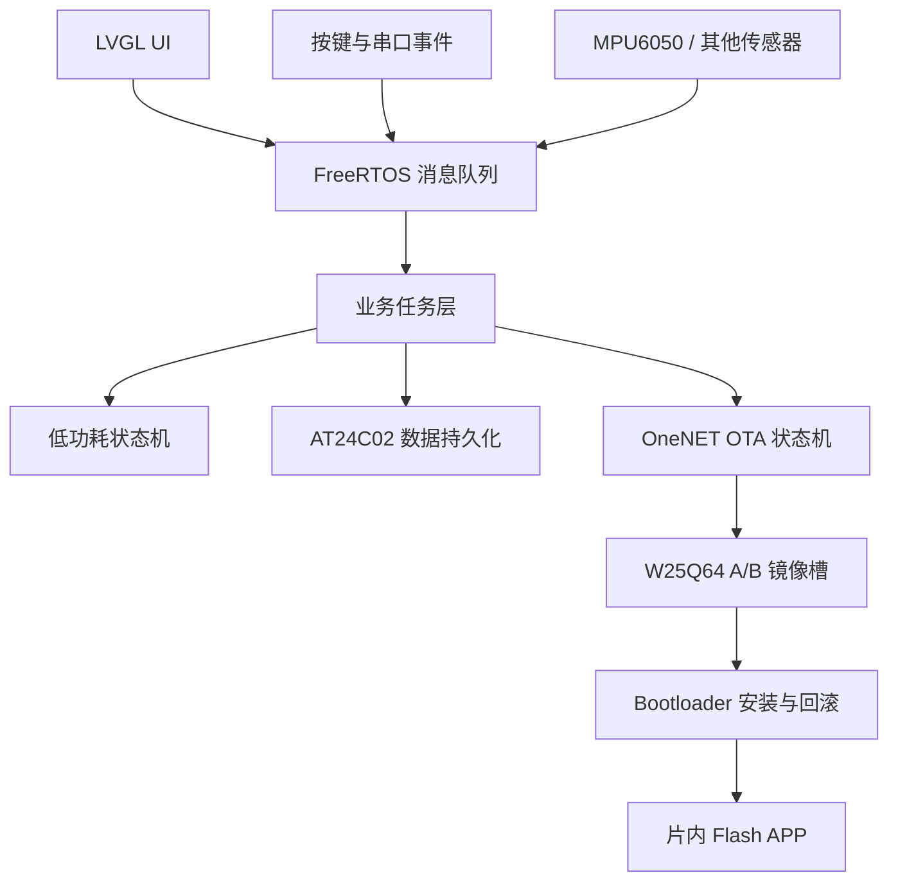

# STM32F411 LVGL 智能手表

基于 **STM32F411CEU6 + FreeRTOS + LVGL** 的智能手表固件项目。项目围绕嵌入式系统中的任务协作、可靠升级、数据持久化和低功耗运行展开，实现了多任务架构、OneNET OTA A/B 升级、EEPROM 可靠存储以及 STOP 模式下的整机功耗管理。

## 项目亮点

### 1. FreeRTOS 多任务架构

将硬件初始化、LVGL 刷新、按键处理、传感器更新、运行模式管理、数据存储、串口通信和 OTA 升级拆分为独立任务，降低模块间耦合。

- 使用消息队列传递按键事件、空闲/休眠请求、界面刷新和数据保存请求。
- 使用软件定时器统计无操作时长，驱动息屏与深度休眠状态切换。
- 数据保存、界面刷新等耗时操作在独立任务中异步执行，避免阻塞输入和传感器采集。
- 任务优先级和栈空间集中配置，便于分析调度关系与后续扩展。

主要实现：[`user_TasksInit.c`](OV_Watch/User/Tasks/Src/user_TasksInit.c)、[`user_MessageSendTask.c`](OV_Watch/User/Tasks/Src/user_MessageSendTask.c)

### 2. OneNET OTA A/B 安全升级

设计了由 APP、外部 Flash 和 Bootloader 协同完成的 OTA 升级流程。STM32F411 从片内 Flash 运行，W25Q64 的两个 1 MiB 分区用于保存新旧固件镜像。

```text
OneNET 升级任务
       |
       v
APP 分片下载到非活动槽 ----> AT24C02 保存下载进度
       |
       v
密文 CRC32 校验 -> 标记 PENDING -> 系统复位
       |
       v
Bootloader 校验镜像 -> AES-128-CTR 解密 -> 写入片内 Flash
       |
       v
试运行确认 ----成功----> CONFIRMED
       |
       +------失败/超次启动------> 自动回滚上一版本
```

- 固件包采用 **AES-128-CTR** 加密，并分别校验密文 CRC32、明文 CRC32 和中断向量表。
- 支持 HTTP Range 分片下载；每 4 KiB 持久化一次偏移，实现断点续传。
- 安装前保留上一版本镜像；安装失败、安装过程掉电或试运行连续 3 次未确认时自动回滚。
- OTA 元数据采用带序列号和 CRC32 的双副本交替提交，降低掉电导致状态损坏的风险。
- OneNET 网络访问通过弱函数接口与具体 4G/Wi-Fi/NB-IoT 模组解耦，便于按实际通信模块适配。

详细的存储布局、镜像打包和接入方法见 [`OTA_README.md`](OTA_README.md)。

### 3. EEPROM 数据持久化

基于 AT24C02 设计用户数据 A/B 双槽记录，用于保存抬腕唤醒开关、APP 校时开关、日期和当日步数等关键参数。

- 每条记录包含魔数、格式版本、递增序列号、CRC16-CCITT 和最后写入的提交标记。
- 启动时校验两个槽并选择最新有效记录；无有效记录时恢复默认配置。
- 设置变更通过消息队列触发异步保存；步数按变化量或最长时间间隔写入，减少 EEPROM 擦写。
- 检测 RTC 日期变化，跨日后自动清零步数；同一天内避免 IMU 异常复位覆盖已保存的较大计数。

主要实现：[`DataSave.c`](OV_Watch/BSP/BL24C02/DataSave.c)、[`user_DataSaveTask.c`](OV_Watch/User/Tasks/Src/user_DataSaveTask.c)

### 4. 整机低功耗管理

通过软件定时器检测无操作时长，按“息屏空闲 -> STOP 深度休眠”分级管理功耗。

- 休眠前关闭背光，使 ST7789 进入 Sleep In，并让 CST816 与 MPU6050 进入低功耗状态。
- 挂起 HAL Tick，清理并重新配置唤醒源后进入 STM32 STOP 模式。
- 支持按键和 MPU6050 抬腕检测等事件唤醒。
- 唤醒后恢复 100 MHz 系统时钟、SysTick、UART、LCD、触摸和传感器状态，并通知首页刷新。

主要实现：[`user_RunModeTasks.c`](OV_Watch/User/Tasks/Src/user_RunModeTasks.c)、[`freertos.c`](OV_Watch/Core/Src/freertos.c)

## 软件架构



## 技术栈与硬件

| 类别 | 方案 |
| --- | --- |
| MCU | STM32F411CEU6，Cortex-M4 |
| RTOS | FreeRTOS / CMSIS-RTOS2 |
| GUI | LVGL |
| 显示与触摸 | ST7789、CST816 |
| 运动检测 | MPU6050 |
| 持久化存储 | AT24C02 EEPROM |
| OTA 镜像存储 | W25Q64 SPI NOR Flash |
| OTA 安全与完整性 | AES-128-CTR、CRC32、A/B 镜像、失败回滚 |
| 开发工具 | STM32CubeMX、Keil MDK-ARM、Python 固件打包脚本 |

## 目录结构

```text
.
├── OV_Watch/          # 智能手表 APP：驱动、FreeRTOS 任务、LVGL UI、OTA 客户端
├── bootloader/        # 固件校验、安装、试运行确认与失败回滚
├── OTA_Common/        # APP 与 Bootloader 共用的 AES、CRC、存储和板级接口
├── tools/             # OTA 加密打包工具
├── tests/             # OTA 加密/元数据及用户数据存储的主机侧测试
└── OTA_README.md      # OTA 存储布局、打包和 OneNET 适配说明
```

## OTA 固件打包示例

完成 Keil APP 构建后，可使用仓库中的脚本生成加密升级包：

```powershell
python tools/ota_pack.py `
  OV_Watch/MDK-ARM/output/OV_Watch.bin `
  OV_Watch/MDK-ARM/output/OV_Watch_v2.4.4.ota `
  --version 2.4.4 `
  --key-hex <32位十六进制AES密钥>
```

> 仓库内置密钥仅用于开发联调。实际产品应通过构建系统注入独立密钥，不应将生产密钥提交到代码仓库。

## 致谢

本项目的 LVGL 智能手表 UI 基于 [No-Chicken/OV-Watch](https://github.com/No-Chicken/OV-Watch) 继续开发；本仓库重点完善了 FreeRTOS 任务协作、OTA、数据持久化与低功耗相关功能。
